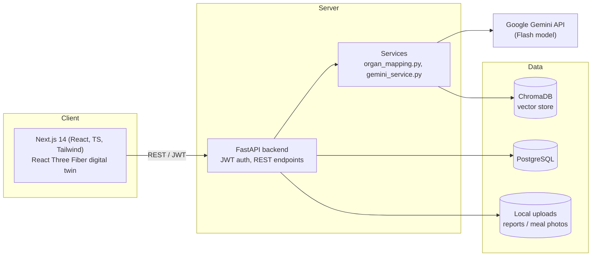
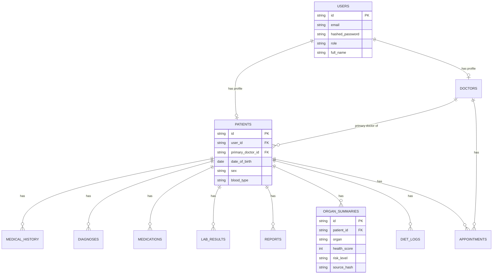

# TwinCare AI

An AI-powered **Digital Patient Twin** platform. Doctors manage patients through
a clickable 3D digital twin that surfaces organ-level AI health insights;
patients get a read-only view of their own twin, medications, reports, and
diet tracking.

> **Status note:** This is a complete, runnable full-stack scaffold covering
> every module in the spec (auth, digital twin, organ insights, reports,
> medications, diet, timeline, Docker, seed data). A few integration points
> that need real infrastructure or licensed assets are implemented with
> clearly-marked, working fallbacks — see [Known Simplifications](#known-simplifications-honest-notes) below.

---

## 1. Architecture



**Request flow for the core feature (clicking an organ):**
`Frontend organ click → GET /organs/{patient_id}/{organ} → backend gathers
diagnoses/medications/labs mapped to that organ → hashes the contributing
records → if the hash changed since the cached OrganSummary, calls Gemini
(or the deterministic fallback) → caches result in Postgres → returns full
insight (score, risk color, summary, follow-up, supporting records).`

## 2. Folder Structure

```
twincare-ai/
├── docker-compose.yml
├── README.md
├── backend/
│   ├── Dockerfile
│   ├── requirements.txt
│   ├── .env.example
│   └── app/
│       ├── main.py                 # FastAPI app, router wiring, CORS
│       ├── core/
│       │   ├── config.py           # Settings (env-driven)
│       │   └── security.py         # JWT + password hashing
│       ├── db/
│       │   └── session.py          # SQLAlchemy engine/session
│       ├── models/models.py        # All ORM tables
│       ├── schemas/schemas.py      # Pydantic request/response models
│       ├── api/
│       │   ├── deps.py             # get_current_user / require_doctor / require_patient
│       │   └── routes/
│       │       ├── auth.py         # /auth/login, /auth/register
│       │       ├── patients.py     # doctor patient list/search, /patients/me
│       │       ├── organs.py       # digital twin overview + per-organ insight
│       │       ├── reports.py      # upload + list medical reports
│       │       ├── medications.py  # list/add medications
│       │       ├── diet.py         # meal photo upload, trends
│       │       └── timeline.py     # chronological timeline
│       ├── services/
│       │   ├── gemini_service.py   # Gemini wrapper + rule-based fallback
│       │   └── organ_mapping.py    # condition/lab → organ mapping table
│       └── seed/seed_data.py       # generates 25 synthetic patients
└── frontend/
    ├── Dockerfile
    ├── package.json
    ├── app/
    │   ├── layout.tsx, globals.css
    │   ├── page.tsx                # Login
    │   ├── doctor/page.tsx         # Doctor dashboard (list/search/alerts)
    │   ├── doctor/[patientId]/page.tsx  # Patient detail: twin/meds/reports/timeline/diet
    │   └── patient/page.tsx        # Patient read-only dashboard
    ├── components/
    │   ├── DigitalTwin.tsx         # React Three Fiber clickable 3D twin
    │   └── OrganPanel.tsx          # AI insight detail panel
    └── lib/api.ts                  # Typed API client (axios)
```

## 3. ER Diagram



## 4. API Documentation

Base path: `/api/v1`. Interactive Swagger UI at `http://localhost:8000/docs`.

| Method | Endpoint | Auth | Description |
|---|---|---|---|
| POST | `/auth/register` | — | Create doctor or patient account |
| POST | `/auth/login` | — | Returns JWT + role |
| GET | `/patients` | doctor | List + search patients, alert counts |
| GET | `/patients/me` | patient | Logged-in patient's own profile |
| GET | `/patients/{id}` | doctor | Single patient profile |
| GET | `/organs/{patient_id}/overview` | any | All 8 organs, color-coded |
| GET | `/organs/{patient_id}/{organ}` | any | Full AI insight for one organ (regenerates if stale) |
| POST | `/reports` | doctor | Upload PDF/image report; extracts + classifies via Gemini |
| GET | `/reports/{patient_id}` | any | List reports |
| GET | `/medications/{patient_id}` | any | List medications |
| POST | `/medications/{patient_id}` | doctor | Add medication (patients are read-only) |
| POST | `/diet/upload` | patient | Upload meal photo → Gemini Vision analysis |
| GET | `/diet/{patient_id}/logs` | any | Meal logs |
| GET | `/diet/{patient_id}/trends` | any | Daily/weekly nutrition + compliance |
| GET | `/timeline/{patient_id}` | any | Chronological medical timeline |

Organs: `brain, heart, lungs, liver, kidneys, pancreas, stomach, blood_vessels`.

## 5. Quick Start (Docker — recommended)

```bash
git clone <this-repo> twincare-ai && cd twincare-ai
cp backend/.env.example backend/.env
# edit backend/.env and set GEMINI_API_KEY=your-key-here (optional but recommended)

docker compose up --build
```

This starts PostgreSQL, ChromaDB, the FastAPI backend (auto-seeds 25 synthetic
patients on first boot), and the Next.js frontend.

- Frontend: http://localhost:3000
- Backend docs: http://localhost:8000/docs

**Demo logins** (created by the seed script):
- Doctor: `doctor@twincare.ai` / `doctor123`
- Patient: `patient@twincare.ai` / `patient123`

## 6. Manual Setup (without Docker)

**Backend**
```bash
cd backend
python -m venv .venv && source .venv/bin/activate
pip install -r requirements.txt
cp .env.example .env   # point DATABASE_URL at your local Postgres
python -m app.seed.seed_data
uvicorn app.main:app --reload
```

**Frontend**
```bash
cd frontend
cp .env.local.example .env.local
npm install
npm run dev
```

## 7. Environment Variables

See `backend/.env.example` and `frontend/.env.local.example`. The single
required variable to unlock full AI features is `GEMINI_API_KEY`
(Google AI Studio). Without it, the app still runs end-to-end using
deterministic rule-based summaries in place of Gemini output — every
endpoint works, screens render, and the digital twin is fully clickable.

## 8. Known Simplifications (honest notes)

- **3D anatomy model:** organs are rendered as clickable, color-coded spheres
  positioned anatomically on a stylized body silhouette (`DigitalTwin.tsx`),
  not licensed photoreal anatomy meshes (no such asset ships free of
  licensing restrictions). Swap in a GLTF anatomy model and keep the same
  click-handler contract to upgrade visuals without touching the API.
- **Synthea data:** the seed script generates 25 patients with realistic,
  internally-consistent synthetic data (diagnoses, meds, labs, timeline)
  in the same *shape* as Synthea output. Swapping in literal Synthea CSV/FHIR
  exports is a drop-in change to `backend/app/seed/seed_data.py`.
- **OCR for scanned images:** PDF text extraction is fully implemented
  (`pypdf`); image-based report OCR is a marked extension point in
  `reports.py` (`_extract_text`) — wire in `pytesseract` or send the image
  directly to Gemini Vision.
- **ChromaDB:** included in `docker-compose.yml` and ready to use, but no
  route currently indexes into it — it's provisioned as the vector store
  for a future semantic-search-over-history feature.
- **Migrations:** tables are created via `Base.metadata.create_all` on
  startup for easy first-run. For real deployments, replace with Alembic
  migrations (`alembic init alembic`, generate from `app.models.models`).
- **Gemini calls:** every AI call (organ insight, report summary, meal
  vision) has a deterministic fallback so the app is fully demoable and
  testable without an API key or network access to Gemini.

## 9. Tech Stack

Frontend: Next.js 14, React 18, TypeScript, Tailwind CSS, React Three Fiber, Three.js, Recharts, Axios.
Backend: FastAPI, SQLAlchemy 2.0, JWT (python-jose), Passlib/bcrypt, Pydantic v2.
Database: PostgreSQL. Vector store: ChromaDB. AI: Google Gemini (Flash).
# DigitalTwin

# DigitalTwin

# DigitalTwin

